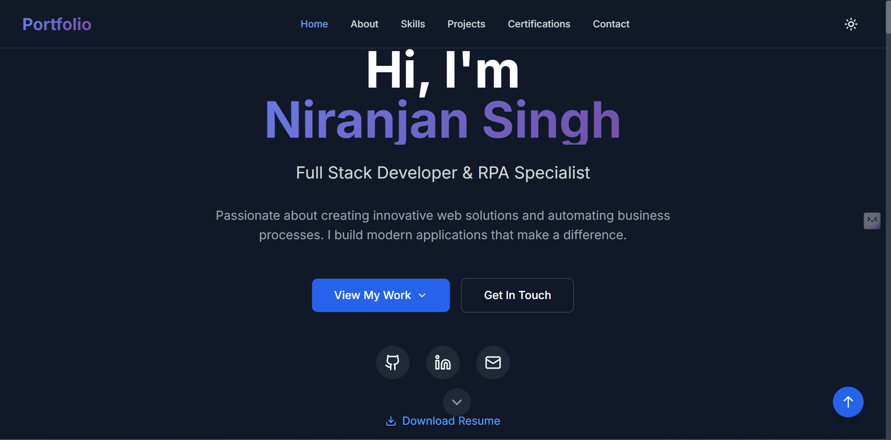

# 🌐 Developer Portfolio – Niranjan Singh

Welcome to my personal developer portfolio website, built with **React**, **Tailwind CSS**, and optionally connected with **MongoDB** for backend features like contact form storage.

## 🧑‍💻 About Me

Hi! I'm **Niranjan Singh**, a passionate **Full Stack Developer** with a love for building scalable web applications and smart automations. This portfolio showcases my skills, projects, certifications, and contact details all in one place.

---

## 🚀 Tech Stack

**Frontend:**
- React.js
- JavaScript (ES6+)
- HTML5 & CSS3
- Tailwind CSS

**Backend:**
- Node.js
- Express.js
- MongoDB

**Tools:**
- Git & GitHub
- VS Code
- UiPath (for RPA)
- Postman

---

## 📁 Folder Structure

```
portfolio-website/
├── public/
├── src/
│   ├── components/       # Reusable React components
│   ├── data/             # Static data (skills, projects, etc.)
│   ├── hooks/            # Custom React hooks (e.g., useTheme)
│   ├── styles/           # Global Tailwind styles
│   ├── utils/            # Helper functions (e.g., section tracking)
│   ├── App.js            # Main app component
│   └── index.js          # App entry point
├── .gitignore
├── tailwind.config.js
├── postcss.config.js
└── README.md
```

---

## 📸 Screenshots


```markdown

```

---

## 📬 Contact Me

You can get in touch through the **Contact** section of the website or connect via:

- [LinkedIn](https://www.linkedin.com/in/niranjan-singh-56541126b/)
- [GitHub](https://github.com/niranjansingh0)
- [Email](mailto:ns916169@gmail.com)

---

## 🛠️ Installation & Setup

1. Clone the repository:
   ```bash
   git clone https://github.com/niranjansingh0/portfolio-website
   ```

2. Navigate to the project folder:
   ```bash
   cd portfolio-website
   ```

3. Install dependencies:
   ```bash
   npm install
   ```

4. Start the development server:
   ```bash
   npm start
   ```

5. Open your browser at:
   ```
   http://localhost:3000
   ```

---

## 🌐 Deployment

You can deploy this app using platforms like:
- [Vercel](https://vercel.com/)
- [Netlify](https://www.netlify.com/)
- [Render](https://render.com/)

---


---

## 🙌 Acknowledgements

- [Lucide React Icons](https://lucide.dev/)
- [Tailwind CSS](https://tailwindcss.com/)
- [React](https://reactjs.org/)
